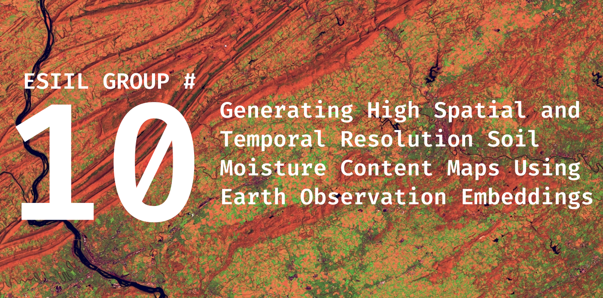
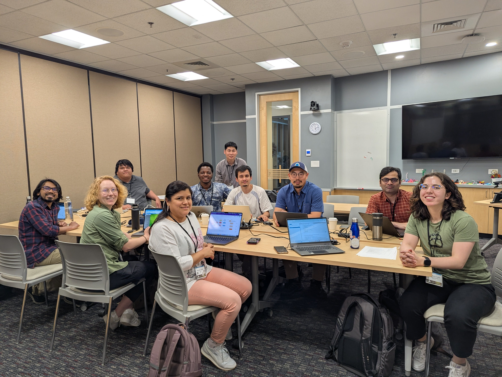
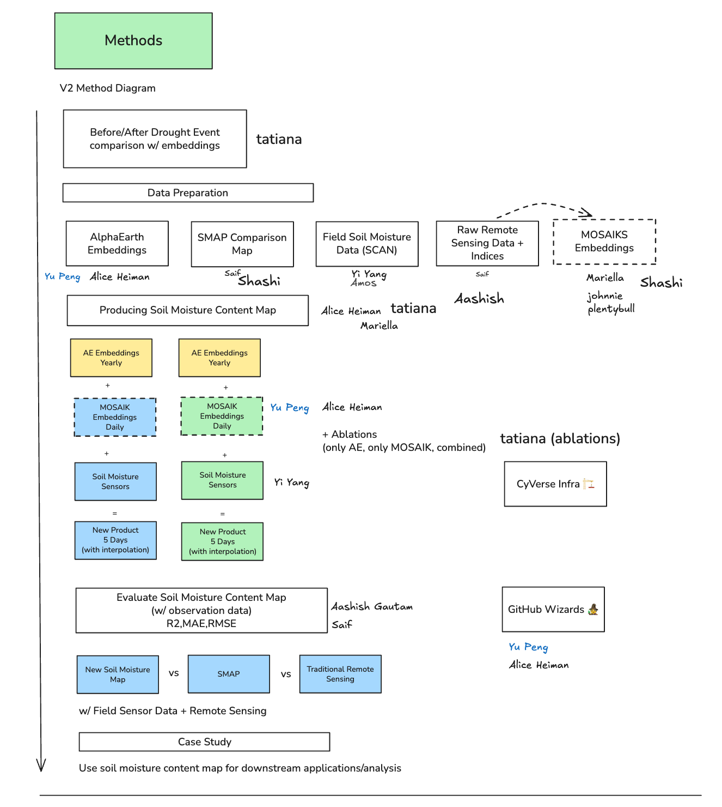
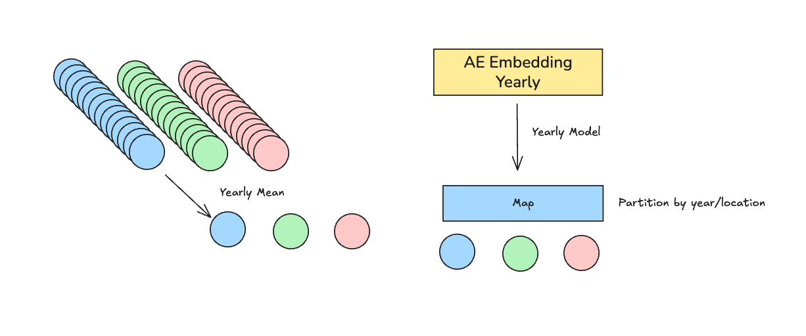
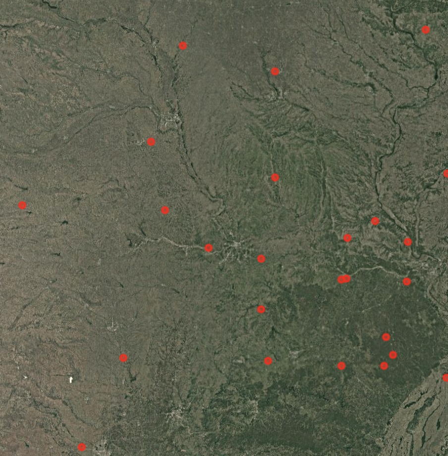
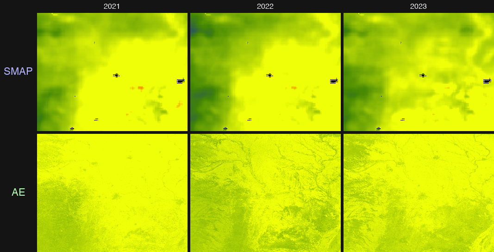
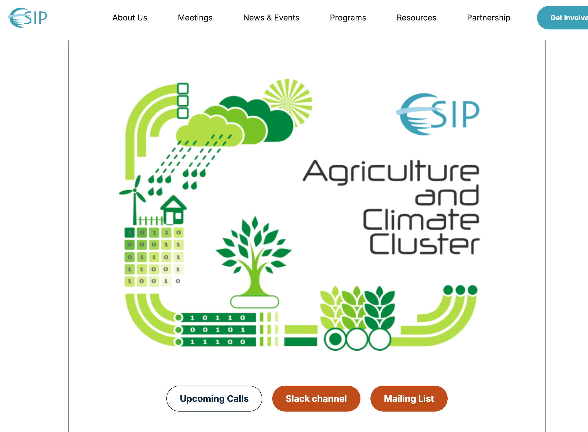
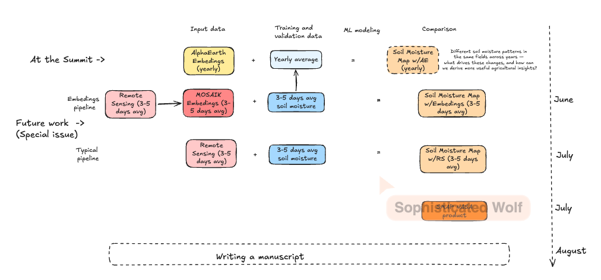

    

# Team 10 Home: Generating High Spatial and Temporal Resolution Soil Moisture Content Maps Using Earth Observation Embeddings

- # Team Photo

## People { #people .oasis-report-out-context }

| Name | Affiliation | Contact | Github |
|---|---|---|---|
| Yi Yang | Colorado State University |yi.yang@colostate.edu |@y1y9ng |
| Aashish Gautam |Jackson State University |aashish.gautam@students.jsums.edu |@aashish66 |
| Mariella Carbajal Carrasco | North Carolina State University|mcarbaj@ncsu.edu | @carbajalmariella|
| Alice Heiman | Stanford University | aheiman@stanford.edu | @aliceheiman |
| Amos Abdulai | Livingstone College| abdulaiamos716@outlook.com| aabdulai116|
| Mohammad Shahriar Saif | Colorado State University | ms.saif@colostate.edu | @saif8091 |
| Yu Peng |Indiana University | yp24@iu.edu|@eco-yupeng |
| Shashi Konduri | NEON | | |
| Johnie |  | | |
|Tatiana Acero-Cuellar|University of Delaware|taceroc@udel.edu|taceroc|

## Our question(s) 📣

Our working question:

- Can Earth Observation Embeddings estimate soil moisture content at higher spatial and temporal resolutions than traditional ML/RS approaches?

Our final product: 

- *Data Product*: Higher spatial and temporal resolution soil moisture map of agricultural areas in California. (starting 2017-2025)
- *Academic Product*: Paper

What would count as progress:

- Specific question
- Roadmap and timeline for future work
- Potentially trying to produce some initial maps with Alpha Earth Foundations model 

## Hypotheses/Intentions
Our hypotheses is that: earth embeddings (which harmonize many different remote sensing data sources) could help us produce higher resolution soil moisture content maps
## Study Area (Soil moisture Station Density Map)

# Why this matters 

This matters because:

- For food security, we need to

- High-value crops like grapes and corn are important for nutrition and agricultral export

- Soil moisture information allow farmers and state-level officials to make more proactive management strategies, for instance in irrigation and drought-preparedness

- California contains the Central Valley, one of the most productive agricultural regions in the US

People who could use this:

- Farmers, land-managements, state-level agriculture officials, food- and beverage industry

# Promising data sources:

- [Data source 1](#): SMAP L4 Global:https://nsidc.org/data/spl4smgp/versions/7
- [Data source 2](#): SMOS: https://earth.esa.int/eogateway/missions/smos
- [Data source 3](#): USGS In-Situ Soil Moisture sensor network for validation
- [Data source 4](#): 30m Crop LULC Regions
- [Data source 5](#): Alpha Earth Embeddings (which includes bands (C&L-bands) which are sensitive to soil moisture)
- [Data source 6](#): Terra Torch Prithvi, Clay, and Terra Mind earth embedding models

# Methods/technologies 📣 

## How we including earth embedding

# Preliminary Results 

## field observation data used for taining

## The comparing: Trained regression via RF model ( AE vs SMAP)
### Top:AlphaEarth Embeddings using yearly field data
### Bottom: SMAP (tranditional RS)

# What’s next? 📣 

- ## Future workshop via ESIP cluster
- ## Monthly meeting （emaillist / slack / Zoom / google storge）
 
- ## Future workflow & roadmap
 

