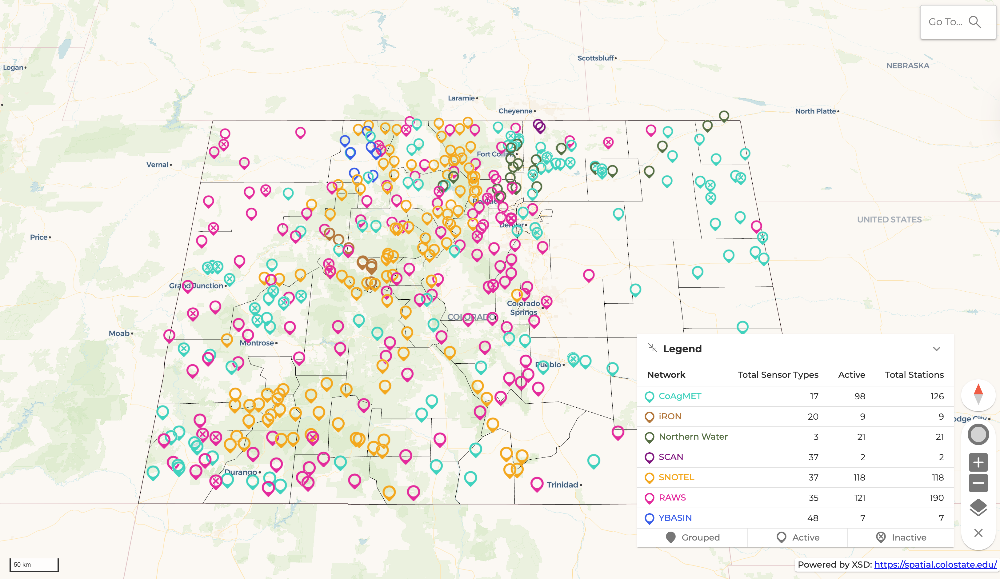
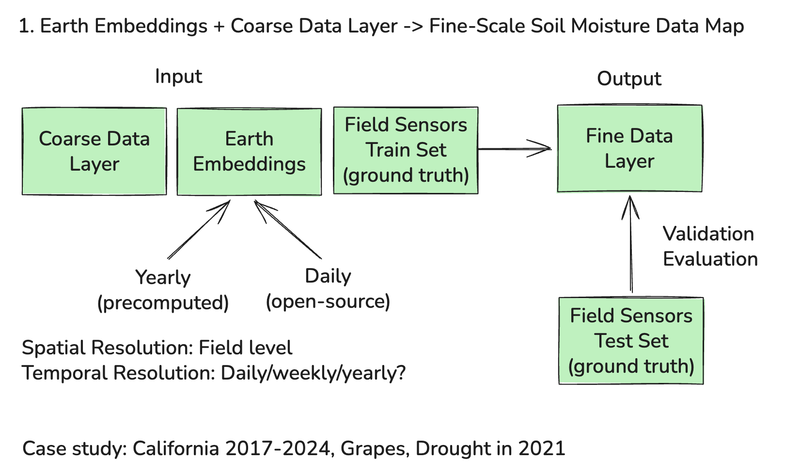
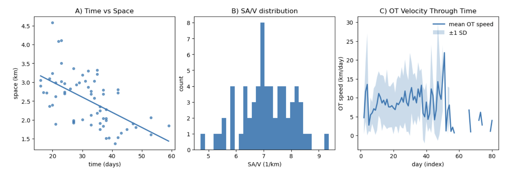

!!! tip "How to use this page during the Summit"
    - This page is your team’s shared workspace and final report-out page. It captures your group’s process and thinking throughout the Summit and will be used to share your work with others. 
    
    - Use this page as your team’s working record during the Summit and your final report-out.
    
    - The Summit has several different goals and thus you will use the page differently each day: Day 1 is for alignment, Day 2 is for building one useful thing, and Day 3 is for synthesis and report- out.
    
    - Look for the green buttons to indicate what you need to edit. 
    
    - Megaphones 📣 indicate which items you will be presenting during the end-of-day report-outs.

    - Only the items with megaphones will be visible when you hit the 'Summit Report Out' button. 

    - If you turn off 'Instructions' then you will only see the page content for public display.
    

# Team 10 Home: Generating High Spatial and Temporal Resolution Soil Moisture Content Maps Using Earth Observation Embeddings

!!! note "Day 1 directions"
    Change the title to the name of your project.

    [Edit Day 1 setup in Markdown](https://github.com/CU-ESIIL/Summit_group_2026_10/edit/main/docs/index.md?plain=1#L21){ .md-button target="_blank" rel="noopener" }

!!! tip "For ESIIL staff"
    Group Number: 10
    
    Breakout Room #: (To be assigned by ESIIL Staff)

    [ESIIL staff edit in Markdown](https://github.com/CU-ESIIL/Summit_group_2026_10/edit/main/docs/index.md?plain=1#L28){ .md-button target="_blank" rel="noopener" }
    

!!! note "How to replace the image above"
    Upload an image that represents your project and welcome people to your page. 
    
    Upload your own image to `docs/assets/hero/` and replace the file named `hero.png`. Use a wide image if you can, then refresh the site preview to check how it looks.
    Keep the file path `docs/assets/hero/hero.png` if you want the Markdown above to keep working.

    [Open image folder for changing image](https://github.com/CU-ESIIL/Summit_group_2026_10/tree/main/docs/assets/hero){ .md-button target="_blank" rel="noopener" }

[See a completed example](example.md){ .md-button }

## People { #people .oasis-report-out-context }

!!! note "Day 1 task"
    Get to know your team: share your cards (5-7 mins). Update your team roster (2-3 min).

    Use the in-person name cards to guide quick introductions.

    | Name card prompts | Follow-up notes |
    |---|---|
    |  |  |

    [Edit People in Markdown](https://github.com/CU-ESIIL/Summit_group_2026_10/edit/main/docs/index.md?plain=1#L63){ .md-button target="_blank" rel="noopener" }

| Name | Affiliation | Contact | Github |
|---|---|---|---|
| Yi Yang | Colorado State University | | |
| Aashish Gautam |Jackson State University |aashish.gautam@students.jsums.edu |@aashish66 |
| Mariella Carbajal Carrasco | | | |
| Alice Heiman | Stanford University | aheiman@stanford.edu | @aliceheiman |
| Amos Abdulai | | | |
| Mohammad Shahriar Saif | Colorado State University | ms.saif@colostate.edu | @saif8091 |
| Yu Peng |Indiana University | yp24@iu.edu|Eco-YuPeng |
| Shashi Konduri | NEON | | |
| Johnie |  | | |
|Tatiana Acero-Cuellar|University of Delaware|taceroc@udel.edu|taceroc|

## Team Norms and Decision Making { #team-norms-and-decision-making }

!!! note "Day 1 task"

    Suggested Self-Facilitation Instructions:
    
    - Round Robin: Everyone shares 1 norm that they think will be important for their team during the Summit and perhaps following the Summit (2 min).

    - After everyone has shared, make a list with as many norms as possible in GitHub (5–7 min).

    - Vote on your top 3 ideas. (Each person gets 3 votes; you can use all your votes on 1 idea or spread them out) (2 min).

    - In GitHub, move all team norms with votes to the top of the list.

    | Gradients of agreement | 
    |---|
    |  | 

    [Edit Team Norms in Markdown](https://github.com/CU-ESIIL/Summit_group_2026_10/edit/main/docs/index.md?plain=1#L87){ .md-button target="_blank" rel="noopener" }

Our AI team norms:

- We believe we *can* use AI for e.g. brainstorming, editing, coding, and data analysis.
- **Data Usage**: we must ensure that we have **data permission** if we want AI to be able to see the data, otherwise ensure we use dummy data and don't put in personal or sensitive data when using AI
- **Data Analysis**: If data we use is open-source / public we can let AI use it. BUT if the data is private or sensitive, use dummy data and 
- **Writing**: We can use it for brainstorming and editing, but *we* should be doing the outlines, the first draft, deep thinking, domain expertise input, and creative ideas.
- **References**: We should find and cite references ourselves.
- **Coding Tools**: We use Claude, Claude Code, GitHub Copilot, ChatGPT, Codex, Gemini. Both web versions and VSCode Extensions.

Our decision making strategy:

*How we did it*

1. Write all ideas on whiteboard

2. Take a pause and think about the suggestions

3. Majority vote on the ideas

4. Pick the majority one, and further iterate using the same process

## Our product(s) 📣 { #product-direction .oasis-report-out-section .oasis-report-out-day2 }

!!! note "Day 2 Tasks"
    Morning Focus: questions, hypotheses, context; add at least one visual (photo of whiteboard/notes)

    Afternoon Focus: try a few datasets and analyses. Keep it visual, keep it simple. Update the site to reflect what you test. 

    [Edit content below here in Markdown](https://github.com/CU-ESIIL/Summit_group_2026_10/edit/main/docs/index.md?plain=1#L106){ .md-button target="_blank" rel="noopener" }

Brainstorm:

1. Use earth embeddings to monitor and predict soil moisture at the field level (or fine-grained)
    - Merge with field sensors
    - GHG emissions
    - Compare earth embeddings vs. remote sensing

2. Ammonia emission
    - tropomi

3. Use AI tool to create input data for ecosystem models to ecosystem services
    - tillage

*We used decision method majority VOTING to select 1. as a direction*

What is the end product?

- Data product

- Perspective/best practices on using Earth Embeddings

- Paper

- Perspective paper

- Grant proposal

Brainstorm Research Question

- Method and output comparison

- Can we leverage Earth Embeddings to generate high resolution soil moisture at certain frequency

- Compare different embedding method

- Compare water stress regions and non-stress regions in earth embedding space (e.g. compare grapes California. E.g. use different remote sensing metrics and see if the earth embeddings)

1st Iteration

- Can we use Earth Embeddings to produce more fine-grained temporal and spatial soil moisture maps of grape fields in California in order to (1) inform irrigation strategies, (2) identify drought areas, and (3) predict in-season drought events (flash-drought)?

2nd Iteration

Overall:
- Can Earth Embeddings be leveraged to produce more fine-grained temporal and spatial soil moisture maps?

Case Study: 

- Data Product: 

    1. Soil-moisture maps of grape fields in California 2017-2025

    2. Crop-stress maps of grape fields in California before and after the 2021 drought event?

3rd Iteration

Scientific Question:

- Can Earth Observation Embeddings estimate soil moisture content at higher spatial and temporal resolutions than traditional ML/RS approaches?

Crop stress

Can this be applied to:

1. Inform irrigation strategies

2. Identify drought areas

3. Robustly identify in-season flash-droughts

Team structure etc.
- Split to explore both yearly composites and daily ones.

## Our question(s) 📣 { #project-question .oasis-report-out-section .oasis-report-out-day2 }

Our working question:

- Can Earth Observation Embeddings estimate soil moisture content at higher spatial and temporal resolutions than traditional ML/RS approaches?

Our final product: 

- *Data Product*: Higher spatial and temporal resolution soil moisture map of agricultural areas in California. (starting 2017-2025)
- *Academic Product*: Paper

What would count as progress:

- Specific question
- Roadmap and timeline for future work
- Potentially trying to produce some initial maps with Alpha Earth Foundations model 

## Hypotheses/Intentions
Our hypotheses is that: earth embeddings (which harmonize many different remote sensing data sources) could help us produce higher resolution soil moisture content maps

## Why this matters (the “upshot”) 📣 { #why-this-matters .oasis-report-out-section .oasis-report-out-day2 }

This matters because:

- For food security, we need to

- High-value crops like grapes and corn are important for nutrition and agricultral export

- Soil moisture information allow farmers and state-level officials to make more proactive management strategies, for instance in irrigation and drought-preparedness

- California contains the Central Valley, one of the most productive agricultural regions in the US

People who could use this:

- Farmers, land-managements, state-level agriculture officials, food- and beverage industry

## Data sources we’re exploring 📣 { #data-exploration .oasis-report-out-section .oasis-report-out-day2 }

!!! note "data exploration"
    Provide a snapshot showing some initial data patterns. 

    Add 2-4 promising data sources (links +1-line notes)    

*Snapshot showing initial data patterns.*

Promising data sources:

- [Data source 1](#): SMAP L4 Global:https://nsidc.org/data/spl4smgp/versions/7
- [Data source 2](#): SMOS: https://earth.esa.int/eogateway/missions/smos
- [Data source 3](#): USGS In-Situ Soil Moisture sensor network for validation
- [Data source 4](#): 30m Crop LULC Regions
- [Data source 5](#): Alpha Earth Embeddings (which includes bands (C&L-bands) which are sensitive to soil moisture)
- [Data source 6](#): Terra Torch Prithvi, Clay, and Terra Mind earth embedding models

## Methods/technologies we’re testing 📣 { #methods-and-code .oasis-report-out-section .oasis-report-out-day2 }

!!! note "methods"
    Add 2-4 methods/technologies we're testing (stats, models, viz).

[View shared code](https://github.com/CU-ESIIL/Summit_group_2026_10/tree/main/code){ .md-button }

Methods/technologies we are testing:

| Method or technology | What we tested | Early note |
|---|---|---|
| Use *yearly* Google AlphaEarth Foundations embeddings to produce soil moisture maps, validate effectiveness with in-situ soil moisture network. | ... | ... |
| Use *daily* earth observation embeddings using MOSAIKS pipeline AND/OR open-source earth foundation models  | ... | ... |
| Combine above approaches with coarse soil moisture maps and training set of in-situ soil moisture network | ... | ... |
| ... | ... | ... |

### Challenges identified

- Google AlphaEarth Foundations Embeddings are yearly, which may not be enough for real-time monitoring
- Crops can cycle

### Visuals

### Next Steps

Short term: 

Long term: 
- Application above (irrigation, drought characterization, flash-drought prediction)

!!! note "Day 3 Tasks"
    Sythesis: highlight 2-3 visuals that tell the story; keep text crisp. Practice a 6-minute walkthrough of the homepage. Why -> Questions -> Data/Methods -> Findings -> Next 

    [Edit content below here in Markdown](https://github.com/CU-ESIIL/Summit_group_2026_10/edit/main/docs/index.md?plain=1#L203){ .md-button target="_blank" rel="noopener" }

## Team Photo { #team-photo }

*Team members and collaborators who contributed to this project.*

## Findings at a glance 📣 { #findings-at-a-glance .oasis-report-out-section .oasis-report-out-day3 }

Headline 1 — what, where, how much

...

Headline 2 — change/trend/contrast

...

Headline 3 — implication for practice or policy

...

## Visuals that tell a story 📣 { #story-visuals .oasis-report-out-section .oasis-report-out-day3 }

*Visual 1: the main pattern or output we want people to remember.*

## What’s next? 📣 { #whats-next .oasis-report-out-section .oasis-report-out-day3 }

Short term:

- ...

Long term:

- ...

Who should see this next

- ...

## Cite & Reuse { #cite-reuse }

If you use these materials, please cite:

Summit Team. (2026). *Summit Group 2026 Team 10 — Innovation Summit 2026*. https://github.com/CU-ESIIL/Summit_group_2026_10

License: CC-BY-4.0 unless noted. 
