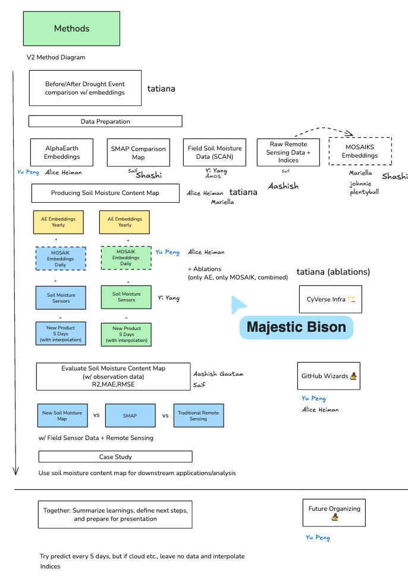

!!! tip "How to use this page during the Summit"
    - This page is your team’s shared workspace and final report-out page. It captures your group’s process and thinking throughout the Summit and will be used to share your work with others. 
    
    - Use this page as your team’s working record during the Summit and your final report-out.
    
    - The Summit has several different goals and thus you will use the page differently each day: Day 1 is for alignment, Day 2 is for building one useful thing, and Day 3 is for synthesis and report- out.
    
    - Look for the green buttons to indicate what you need to edit. 
    
    - Megaphones 📣 indicate which items you will be presenting during the end-of-day report-outs.

    - Only the items with megaphones will be visible when you hit the 'Summit Report Out' button. 

    - If you turn off 'Instructions' then you will only see the page content for public display.
    

# Team 10 Home: Generating High Spatial and Temporal Resolution Soil Moisture Content Maps Using Earth Observation Embeddings

!!! note "Day 1 directions"
    Change the title to the name of your project.

    [Edit Day 1 setup in Markdown](https://github.com/CU-ESIIL/Summit_group_2026_10/edit/main/docs/index.md?plain=1#L21){ .md-button target="_blank" rel="noopener" }

!!! tip "For ESIIL staff"
    Group Number: 10
    
    Breakout Room #: (To be assigned by ESIIL Staff)

    [ESIIL staff edit in Markdown](https://github.com/CU-ESIIL/Summit_group_2026_10/edit/main/docs/index.md?plain=1#L28){ .md-button target="_blank" rel="noopener" }
    

!!! note "How to replace the image above"
    Upload an image that represents your project and welcome people to your page. 
    
    Upload your own image to `docs/assets/hero/` and replace the file named `hero.png`. Use a wide image if you can, then refresh the site preview to check how it looks.
    Keep the file path `docs/assets/hero/hero.png` if you want the Markdown above to keep working.

    [Open image folder for changing image](https://github.com/CU-ESIIL/Summit_group_2026_10/tree/main/docs/assets/hero){ .md-button target="_blank" rel="noopener" }

[See a completed example](example.md){ .md-button }

## People { #people .oasis-report-out-context }

| Name | Affiliation | Contact | Github |
|---|---|---|---|
| Yi Yang | Colorado State University |yi.yang@colostate.edu |@y1y9ng |
| Aashish Gautam |Jackson State University |aashish.gautam@students.jsums.edu |@aashish66 |
| Mariella Carbajal Carrasco | North Carolina State University|mcarbaj@ncsu.edu | @carbajalmariella|
| Alice Heiman | Stanford University | aheiman@stanford.edu | @aliceheiman |
| Amos Abdulai | Livingstone College| abdulaiamos716@outlook.com| aabdulai116|
| Mohammad Shahriar Saif | Colorado State University | ms.saif@colostate.edu | @saif8091 |
| Yu Peng |Indiana University | yp24@iu.edu|Eco-YuPeng |
| Shashi Konduri | NEON | | |
| Johnie |  | | |
|Tatiana Acero-Cuellar|University of Delaware|taceroc@udel.edu|taceroc|

## Our question(s) 📣 { #project-question .oasis-report-out-section .oasis-report-out-day2 }

Our working question:

- Can Earth Observation Embeddings estimate soil moisture content at higher spatial and temporal resolutions than traditional ML/RS approaches?

Our final product: 

- *Data Product*: Higher spatial and temporal resolution soil moisture map of agricultural areas in California. (starting 2017-2025)
- *Academic Product*: Paper

What would count as progress:

- Specific question
- Roadmap and timeline for future work
- Potentially trying to produce some initial maps with Alpha Earth Foundations model 

## Hypotheses/Intentions
Our hypotheses is that: earth embeddings (which harmonize many different remote sensing data sources) could help us produce higher resolution soil moisture content maps
## Study Area (Soil moisture Station Density Map)

## Why this matters 

This matters because:

- For food security, we need to

- High-value crops like grapes and corn are important for nutrition and agricultral export

- Soil moisture information allow farmers and state-level officials to make more proactive management strategies, for instance in irrigation and drought-preparedness

- California contains the Central Valley, one of the most productive agricultural regions in the US

People who could use this:

- Farmers, land-managements, state-level agriculture officials, food- and beverage industry

## Promising data sources:

- [Data source 1](#): SMAP L4 Global:https://nsidc.org/data/spl4smgp/versions/7
- [Data source 2](#): SMOS: https://earth.esa.int/eogateway/missions/smos
- [Data source 3](#): USGS In-Situ Soil Moisture sensor network for validation
- [Data source 4](#): 30m Crop LULC Regions
- [Data source 5](#): Alpha Earth Embeddings (which includes bands (C&L-bands) which are sensitive to soil moisture)
- [Data source 6](#): Terra Torch Prithvi, Clay, and Terra Mind earth embedding models

## Methods/technologies we’re testing 📣 { #methods-and-code .oasis-report-out-section .oasis-report-out-day2 }

!!! note "methods"
    Add 2-4 methods/technologies we're testing (stats, models, viz).

[View shared code](https://github.com/CU-ESIIL/Summit_group_2026_10/tree/main/code){ .md-button }

Methods/technologies we are testing:

| Method or technology | What we tested | Early note |
|---|---|---|
| Use *yearly* Google AlphaEarth Foundations embeddings to produce soil moisture maps, validate effectiveness with in-situ soil moisture network. | ... | ... |
| Use *daily* earth observation embeddings using MOSAIKS pipeline AND/OR open-source earth foundation models  | ... | ... |
| Combine above approaches with coarse soil moisture maps and training set of in-situ soil moisture network | ... | ... |
| ... | ... | ... |

### Challenges identified

- Google AlphaEarth Foundations Embeddings are yearly, which may not be enough for real-time monitoring

### Visuals

# General Method 

# How we including earth embedding

*Team members and collaborators who contributed to this project.*

## Results 

## field observation data used for taining

## The comparing 
# Trained regression via RF model ( AE vs SMAP)
Top:AlphaEarth Embeddings using yearly field data
Bottom: SMAP (tranditional RS)

## What’s next? 📣 { #whats-next .oasis-report-out-section .oasis-report-out-day3 }

- Future workshop via ESIP cluster
- Monthly meeting （emaillist / slack / Zoom / google storge）
 

 
Who should see this next

- ...

- ## Team Photo { #team-photo }

## Cite & Reuse { #cite-reuse }

If you use these materials, please cite:

Summit Team. (2026). *Summit Group 2026 Team 10 — Innovation Summit 2026*. https://github.com/CU-ESIIL/Summit_group_2026_10

License: CC-BY-4.0 unless noted. 
